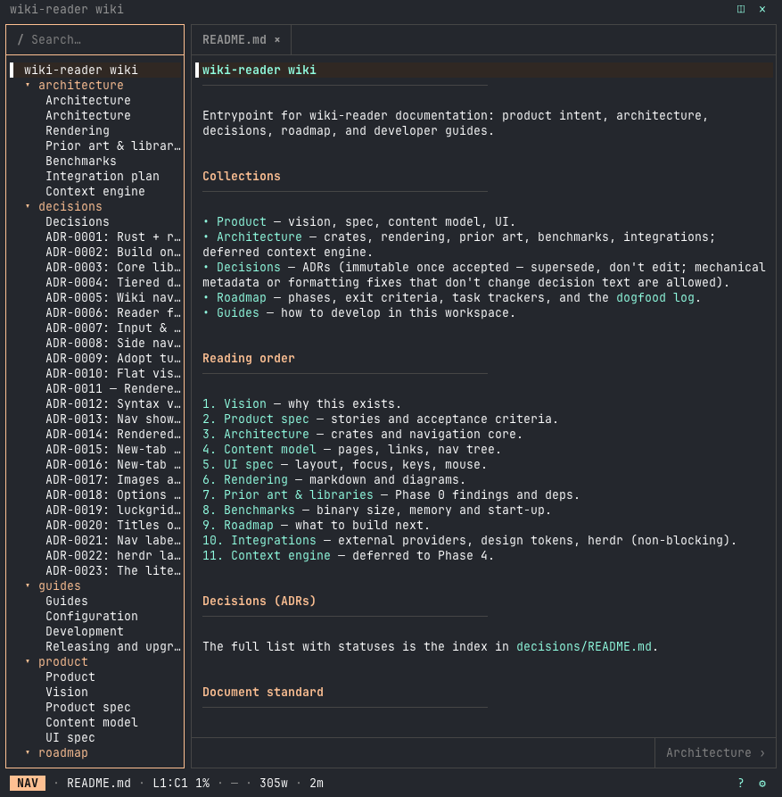

# wiki-reader

A terminal wiki reader for markdown collections. It browses like a documentation site (side nav, breadcrumbs, working links, back/forward, prev/next), sized to live in a herdr pane next to your work.

<!-- ui-diagram:start -->
```text
 Worked Example Wiki                                                        ◫ ✕
┌────────────────────────┐┌ README.md ×                                        ┐
│▌/ Search…              │├━━━━━━━━━━━━━───────────────────────────────────────┤
│                        ││▌── frontmatter ▸ ──────────────────────────────────│
│▌ Worked Example Wiki   ││                                                    │
│  ▸ architecture        ││                                                    │
│  ▸ decisions           ││ Worked Example Wiki                                │
│                        ││ ────────────────────────────────────────           │
│                        ││                                                    │
│                        ││ A tiny markdown collection used as the default     │
│                        ││ smoke-test root.                                   │
│                        ││                                                    │
│                        ││                                                    │
│                        ││                            Architecture Overview › │
└────────────────────────┘└────────────────────────────────────────────────────┘
  VIEW  · README.md · L1:C1 9% · 2026-09-28 · draft · 29w · 1m              ? ⚙
```
<!-- ui-diagram:end -->



Help (`?`), search (`/`) and options (`,` or `c`) are popups over the same layout. Click `?` / ⚙ at the full-width layout footer's bottom right, below both panes, for Help / Options; the header retains ◫ / ✕ for nav / quit.

Nav rows show page titles by default (`nav.labels = "filename"` switches to filenames); folders always show the folder name. Press `?` in the app for every key.

## Why not an existing reader?

Existing terminal markdown tools behave like editors or file browsers: opening a page spawns a tab, links are inert, and search lives in a modal. wiki-reader uses a **browser/wiki navigation model**. Every way of reaching a page replaces the current view and records history, and tabs are an opt-in secondary feature. See [ADR-0005](wiki/decisions/0005-navigation-model.md).

## Credits

wiki-reader exists because of [markdown-reader](https://github.com/leboiko/markdown-reader) by [leboiko](https://github.com/leboiko) (MIT), and we are grateful for it. It was the first thing tried for browsing a wiki in a terminal and the best of its kind. Much of what wiki-reader does for a page started as something markdown-reader showed was possible: the tree beside a rendered page, tables, code blocks and a frontmatter box that read well, Mermaid diagrams in the terminal, live reload, and a settings window, whose grouped radio-button layout wiki-reader's options window borrows.

wiki-reader also depends directly on [`mermaid-text`](https://crates.io/crates/mermaid-text), markdown-reader's author's crate, for its text-mode diagrams. The rest of the page rendering is written fresh for wiki-reader's navigation model.

Other tools that shaped it, and what each contributed, are listed in [Prior art and libraries](wiki/architecture/prior-art-and-libs.md): treemd, md-tui, Frogmouth, Glow and others. If you want an editor-style markdown browser rather than a wiki reader, markdown-reader is the one to use.

## Status

Phase 2 is feature-complete on a dogfood hold (clock 2026-09-29 → ≈ 2026-10-13); Phase 3 alpha polish is active. See the [roadmap](wiki/roadmap/README.md) for what shipped and what's next, and the [dogfood log](wiki/roadmap/dogfood-log.md) for dated bites. Prereleases and binaries are on [GitHub Releases](https://github.com/luckgrid/wiki-reader/releases).

## Install

From git (supported today):

```bash
cargo install --locked --git https://github.com/luckgrid/wiki-reader wiki-reader
```

Release binaries (macOS arm64 / x86_64, Linux x86_64) ship on `v*` tags under [GitHub Releases](https://github.com/luckgrid/wiki-reader/releases). Download the matching `.tar.gz`, verify the checksum, and put `wiki-reader` on your `PATH`:

```bash
shasum -a 256 -c wiki-reader-vX.Y.Z-<platform>.tar.gz.sha256
tar xf wiki-reader-vX.Y.Z-<platform>.tar.gz
```

Binaries are unsigned and not notarized. Browser downloads on macOS may be quarantined; clear with `xattr -d com.apple.quarantine path/to/wiki-reader` if Gatekeeper blocks them (`curl` downloads usually skip quarantine). The Linux binary is built on `ubuntu-latest` and links that runner's glibc, so older distros may need to build from source or use `cargo install`.

crates.io packaging metadata is prepared (`version` on path deps, repository/readme); the crates are not published yet.

## Upgrade

Check your version with `wiki-reader --version` and `which wiki-reader`. Upgrade the **same way you installed** (mixing paths leaves two binaries; whichever is first on `PATH` wins).

```bash
# cargo install → ~/.cargo/bin (--force replaces it; add --tag v0.1.N to pin one)
cargo install --locked --force --git https://github.com/luckgrid/wiki-reader wiki-reader

# release tarball → usually ~/.local/bin (verify and unpack as above, then overwrite)
install -m 0755 wiki-reader-vX.Y.Z-<platform>/wiki-reader ~/.local/bin/wiki-reader
```

If `which wiki-reader` and the install target disagree, remove the extra copy or put the intended directory earlier on `PATH`. Quit any running instance first. Your config and saved sessions are kept. Rolling back, uninstalling, resetting sessions, and replacing a published release are covered in [Releasing and upgrading](wiki/guides/releasing.md).

## Quickstart

```bash
cargo run -p wiki-reader -- fixtures/worked-example
# q to quit, ? for help
```

Or after install:

```bash
wiki-reader fixtures/worked-example
# q to quit, ? for help
```

## Checks

```bash
cargo fmt --check
cargo clippy --locked --all-targets -- -D warnings
cargo test --locked
cargo run --locked --quiet -p wiki-reader-tools --bin link-check
rumdl fmt --check .
rumdl check .
```

## Workspace

Cargo workspace with `wiki-reader-core` (terminal-free), `wiki-reader-render`, and the `wiki-reader` TUI binary. Docs live in `wiki/`. See [guides/development.md](wiki/guides/development.md).

## License

Copyright © 2026 LUCKGRID. Dual-licensed under [MIT](LICENSE-MIT) or [Apache-2.0](LICENSE-APACHE), at your option. The two licenses are alternatives: users need to comply with only the one they choose.
