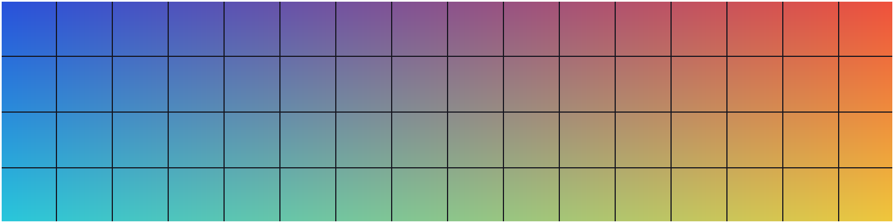

# Image fixtures

Manual and snapshot inputs for P3-12b. The cases that must **not** render a picture are
intentional: remote URLs, `..` escapes and missing files all show the text placeholder.

## Local images

A small PNG (20×4 cells at 8×17 px cells):

A wide PNG that shrinks to the pane width:

A JPEG:

A tall PNG, capped at 30 rows, with a white stripe every 100 px to check scroll cropping:

Text after the last image.

## Placeholders

A remote image is never fetched:

A path that escapes the collection:

A missing file:

An unsupported format:

## Inline

An image inside a sentence  stays inline text.

- 

> 
