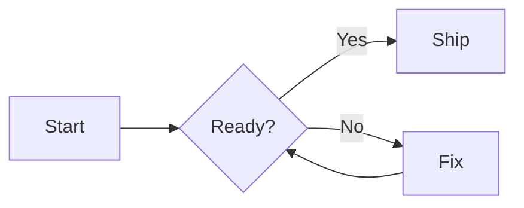
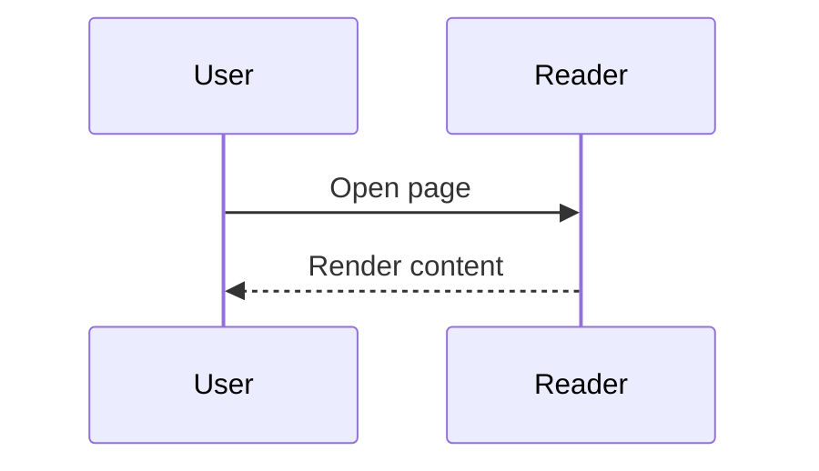
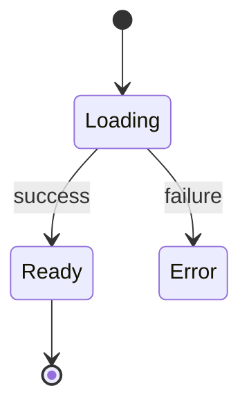
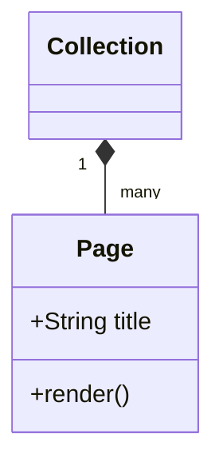
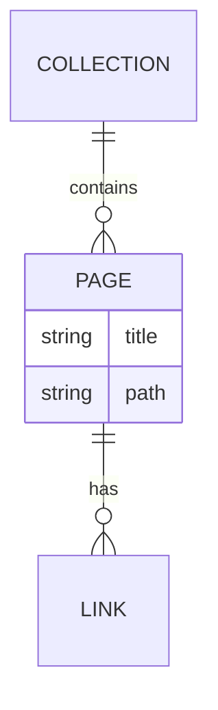
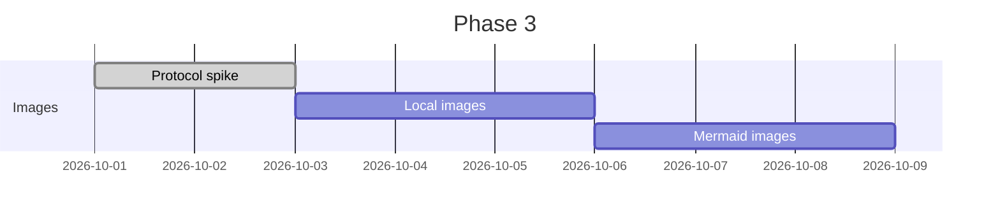

# Mermaid image spike cases

## Flowchart

```mermaid
flowchart LR
  A[Start] --> B{Ready?}
  B -->|Yes| C[Ship]
  B -->|No| D[Fix]
  D --> B
```

## Sequence

```mermaid
sequenceDiagram
  participant U as User
  participant R as Reader
  U->>R: Open page
  R-->>U: Render content
```

## State

```mermaid
stateDiagram-v2
  [*] --> Loading
  Loading --> Ready: success
  Loading --> Error: failure
  Ready --> [*]
```

## Class

```mermaid
classDiagram
  class Page {
    +String title
    +render()
  }
  class Collection
  Collection "1" *-- "many" Page
```

## Entity relationship

```mermaid
erDiagram
  COLLECTION ||--o{ PAGE : contains
  PAGE ||--o{ LINK : has
  PAGE {
    string title
    string path
  }
```

## Gantt

```mermaid
gantt
  title Phase 3
  dateFormat YYYY-MM-DD
  section Images
  Protocol spike :done, p3a, 2026-10-01, 2d
  Local images :p3b, after p3a, 3d
  Mermaid images :p3c, after p3b, 3d
```
