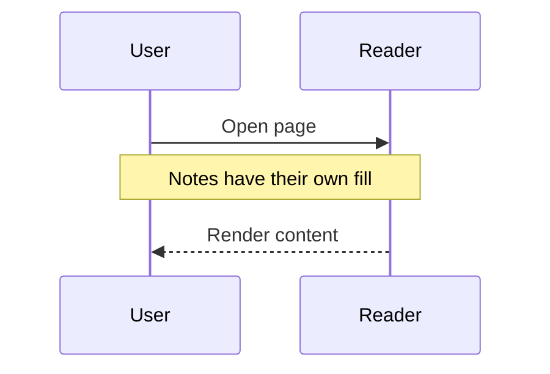
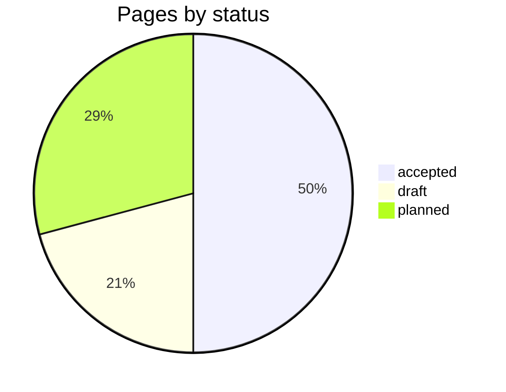
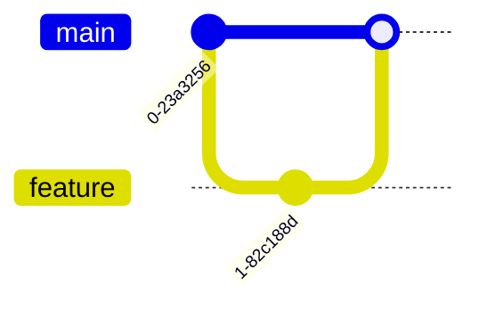

# Themed Mermaid cases

Diagram types whose colours come from the theme palette, not only node fills. Open under
`theme = "dark"`, `"light"` and `"herdr"` and check each card against the page.

## Sequence with a note

## Pie

## Git graph

