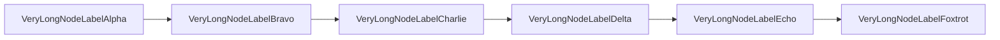

# Wide Mermaid (text-tier fallback)

This flowchart is intentionally wide so the image-tier legibility gate rejects it.

```mermaid
flowchart LR
  AAAAAAAAAA[VeryLongNodeLabelAlpha] --> BBBBBBBBBB[VeryLongNodeLabelBravo]
  BBBBBBBBBB --> CCCCCCCCCC[VeryLongNodeLabelCharlie]
  CCCCCCCCCC --> DDDDDDDDDD[VeryLongNodeLabelDelta]
  DDDDDDDDDD --> EEEEEEEEEE[VeryLongNodeLabelEcho]
  EEEEEEEEEE --> FFFFFFFFFF[VeryLongNodeLabelFoxtrot]
```
