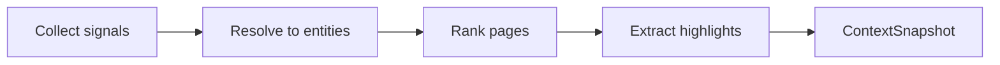

# Context engine

> [!NOTE]
> **Deferred to v2.** v1 is the wiki reader (tree + reader + footer). This draft is kept as the likely first widget in a future right-hand **widget sidebar** (a slot for custom features/plugins). The requirements aren't settled. Treat everything below as exploration, not spec.

## Pipeline



## 1. Signals

Signals are collected independently. Each is optional, and each records whether it was found, missing, or failed.

| Priority | Signal | Source | Notes |
|----------|--------|--------|-------|
| 1 | Manual pin | `f` key or `wiki-reader focus <ID\|path>` | Always wins. Persisted per root in session state. |
| 2 | Git branch | `git rev-parse --abbrev-ref HEAD` in the context repo | Parsed with configured patterns into work unit IDs. |
| 3 | herdr workspace | `HERDR_WORKSPACE_ID`, then `herdr pane list --workspace <id>` | Sibling panes' `cwd` / `foreground_cwd`, agent state, agent labels. JSON output. |
| 4 | Working directory | Process cwd, or `--context-dir` | Mapped through path rules. |
| 5 | Recent changes | `git status` / recent commits in context repos | "What the agents are touching." |
| 6 | Current page | The page open in the viewer | Its own IDs and links count as weak context. |

### Context repo vs. collection root

The collection you're **reading** and the repo you're **working in** are often different. Examples: reading `~/Workspaces/uwiki/` while agents work in `~/Workspaces/design-system/`. So context signals are gathered from context directories, not the collection root:

- `--context-dir` flag (repeatable), else
- herdr sibling pane cwds (deduplicated to git roots), else
- the process cwd.

This is the main reason herdr integration matters. It lets the wiki pane know where the *other* panes are.

## 2. Resolution

Signals resolve into **entities**: work units, workspaces, paths, tags.

### Work unit IDs

Configured as named patterns so the grammar isn't hard-coded. Example based on the current Luckgrid convention (branch `ds/e01-s4-t2-utility-variant-extraction` ↔ ID `DS-E01.S4.T2`):

```toml
[[context.work_unit]]
name = "program-task"
# ID as it appears in text
id_pattern = '\b(?P<prog>[A-Z]{2,5})-E(?P<e>\d{2})(?:\.S(?P<s>\d+))?(?:\.T(?P<t>\d+))?\b'
# branch → ID
branch_pattern = '^(?P<prog>[a-z]{2,5})/e(?P<e>\d{2})(?:-s(?P<s>\d+))?(?:-t(?P<t>\d+))?'
id_template = "{prog|upper}-E{e}{.S{s}}{.T{t}}"
```

The ID is hierarchical, so resolution also yields ancestors: `DS-E01.S4.T2` → `DS-E01.S4` → `DS-E01`. Ancestor matches rank lower than exact ones.

### Path rules

```toml
[[context.path_rule]]
match = "~/Workspaces/design-system/**"
workspace = "design-system"
tags = ["design-system", "tokens"]
pages = ["architecture/design-system/**"]   # globs within the collection
```

### Page-declared applicability

Pages can declare what they apply to. This is often the most reliable signal because the author wrote it on purpose:

```yaml
---
applies_to: ["~/Workspaces/design-system/**"]
work_units: ["DS-E01.S4"]
tags: [tokens, tailwind]
---
```

## 3. Ranking

Each candidate page gets a score as the sum of weighted reasons. **Reasons are kept and shown in the UI**, because "why is this here" builds trust and makes bad rules easy to fix.

| Reason | Default weight |
|--------|---------------:|
| Pinned | 100 |
| Frontmatter `id` equals an exact work unit | 60 |
| Frontmatter `work_units` contains an exact work unit | 50 |
| Mentions an exact work unit in body | 30 (+2 per extra mention, capped) |
| `applies_to` matches a context dir | 40 |
| Path rule `pages` glob | 35 |
| Mentions an ancestor work unit | 12 |
| Tag overlap | 8 per tag |
| Modified in the last 24 h (git) | 10 |
| Linked from a top-3 page | 6 |

Weights live in config. The defaults are a hypothesis to be tuned with the phase-0 spot checks. Show the top 5–8 pages, with ties broken by recency.

## 4. Highlights

Short, extracted facts shown under the context header. Sources, in order:

1. Frontmatter: `summary`, `status`, `owner`, `updated`.
2. Callouts: `> [!goal]`, `> [!decision]`, `> [!risk]`, `> [!todo]` (GitHub/Obsidian-style alert syntax).
3. Sections whose heading matches `Goals|Status|Next steps|Open questions` → the first 1–3 list items.
4. Unchecked task list items (`- [ ]`) in context pages, as open work.

Rule: the sidebar never shows more than ~12 lines of highlights. Everything else is one keypress away.

## 5. Output

`wiki-reader context --json` prints a `ContextSnapshot`:

```json
{
  "signals": [{"source":"git_branch","value":"ds/e01-s4-t2-utility-variant-extraction","dir":"~/Workspaces/design-system"}],
  "work_units": ["DS-E01.S4.T2"],
  "related": [
    {"page":"design-system/S4-T2.md","score":90,"reasons":["frontmatter id = DS-E01.S4.T2","mentions ×3"]}
  ],
  "highlights": [{"page":"design-system/S4-T2.md","kind":"status","text":"implemented / review-pending"}],
  "unavailable": [{"source":"herdr","reason":"HERDR_ENV not set"}]
}
```

The TUI renders exactly this structure. If the CLI output is useful, the panel will be too. That is the phase-1 test.

## Refresh & stability

- Recompute when signals change, debounced ~300 ms.
- **Don't reshuffle under the user.** If the top list changes while the sidebar has focus, show a "context changed — press `R`" hint instead of reordering.
