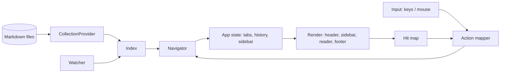

# Architecture

Crate layout, the navigation core, hit-testing, and runtime model for wiki-reader.

## Shape



## Crates

```text
wiki-reader/
├── Cargo.toml                 # workspace
├── crates/
│   ├── wiki-reader-core/      # no terminal deps
│   │   ├── provider/          # CollectionProvider trait + FsProvider
│   │   ├── parse/             # frontmatter split, pulldown-cmark walk, links, headings
│   │   ├── index/             # pages, headings, edges (links/backlinks), search
│   │   ├── nav/               # link resolution, NavTree build (titles, folding, order), prev/next
│   │   ├── watch/             # notify-debouncer-mini → markdown dirty flag
│   │   └── config/
│   ├── wiki-reader-render/    # markdown → RenderedDoc (lines + link spans + source map)
│   └── wiki-reader/           # binary: TUI app
│       └── tui/               # app state, navigator, layout, regions, hit map, keymap, theme
├── wiki/                      # this collection (dogfood)
└── fixtures/                  # sample collections incl. broken links, SUMMARY.md, deep trees
```

The context engine ([context engine](context-engine.md)) and agent CLI are Phase 4. They'll live in `wiki-reader-core/context` and a `cli` module, which is why `core` stays free of terminal code ([ADR-0006](../decisions/0006-reader-first.md)).

## Navigation core (the heart of v1)

Every entry point produces an `Action::Navigate`. Nothing else changes the current page.

```rust
enum Target { Page(PageKey, Option<Anchor>), Anchor(Anchor), External(Url), Unresolved(String) }
enum Disposition { Replace, NewTab, BackgroundTab }

struct Location { page: PageKey, anchor: Option<Anchor>, cursor_line: u32, scroll: u32, mode: ViewMode }
struct Tab { history: Vec<Location>, cursor: usize }       // browser-style stack
struct App { /* TUI-owned: focus, hit_map, overlay, …; history via Navigator */ }
// History mutator is Navigator (core); TUI applies Effect::{LoadPage, RevealInTree, ScrollTo}.

enum Focus { Nav, Viewer }
struct NavState {
    tree: NavTree,                 // built by core::nav from the folding rules ([content model](../product/content-model.md))
    expanded: HashSet<NodeId>,
    cursor: Option<NodeId>,        // remembered cursor; None → current page's item
    seen_page: Option<PageKey>,    // page current when nav last had focus (stale-cursor rule, [UI spec](../product/ui-spec.md))
}
// Viewer cursor lives in the active Tab's current Location (cursor_line) plus
// `focused_item: Option<ItemId>` for the Tab cycle.

impl App {
    fn navigate(&mut self, target: Target, how: Disposition) -> Effect {
        // 1. resolve (Unresolved → footer notice, External → opener confirm)
        // 2. save scroll into current Location
        // 3. Replace: truncate forward history, push; NewTab: new Tab with one entry
        // 4. emit Effect::{LoadPage, RevealInTree, ScrollTo(anchor)}
    }
    fn back(&mut self); fn forward(&mut self);
}
```

**Invariant tests** (N1): for each entry point (tree select, search result, link click, link Enter, breadcrumb, prev/next, back/forward, CLI start page), assert the resulting `Tab.history` and tree selection. This invariant was violated in markdown-reader and caused most of the Phase 0 friction.

## Regions & hit map

The screen is split into regions: `Header`, `SideNav` (future sub-regions: header, list, footer), `TabBar` (optional), `Viewer` (future sticky header; body; sticky `ViewerFooter`), `StatusBar`, an optional `SearchOverlay`, and later `Widgets`. Each region renders itself and **registers clickable areas** in a per-frame `HitMap`:

```rust
enum Hit { Link(LinkId), BlockAction(ItemId), NavItem(NodeId), NavGroupToggle(NodeId),
           NavSearchRow, Breadcrumb(NodeId), NavToggle, Quit, Prev, Next,
           Tab(usize), TabClose(usize), SearchResult(usize), ViewerLine(u32) }
struct HitMap(Vec<(Rect, Hit)>);   // rebuilt every frame, searched in reverse (topmost wins)
```

Mouse events are resolved against the last frame's hit map and turned into the same `Action`s as keys. This one mechanism is what makes "clickable everything" cheap and consistent.

For links, the renderer emits `LinkSpan { id, target, line, col_range }` per wrapped line segment. The reader converts visible spans to screen rects when drawing, so a link that wraps across two lines is clickable on both.

## Runtime model

- Synchronous crossterm `event::poll` loop on the UI thread (no tokio; [ADR-0011](../decisions/0011-renderer-source.md)). Each wake applies every queued event (capped at 256) before a single redraw, so wheel and mouse-move floods don't back up behind full redraws; unread input is drained when the terminal is restored.
- Background workers on std threads with `mpsc` channels: index rebuild, syntect highlight for raw view. The `notify` debouncer runs on its own thread and posts into the same poll loop.
- State lives in one `App`; rendering is a pure function of state (+ caches) that also produces the `HitMap`.

## Persistence

- Index: in memory, rebuilt on start (a cache is optional later).
- Session (per root): tabs with histories (incl. viewer cursors), active tab, side nav expansion + cursor → `$XDG_STATE_HOME/wiki-reader/state.toml`.

## Error philosophy

The core returns typed errors, and the UI shows them in the footer. Parsing is lenient, and raw view is always available. A failed navigation never loses the current page.
