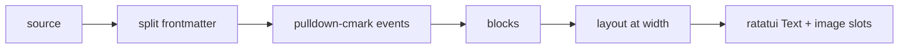

# Rendering

How markdown, raw source, code, tables, and diagrams are rendered, including herdr's graphics constraints.

## Pipeline



- Rendering produces a `RenderedDoc`: a list of blocks, each with its source line range. This mapping is what makes the raw toggle, `$EDITOR` jumps, and link focus line up.
- Layout is width-dependent and cached per `(page, width, theme)`.
- **In-tree renderer** ([ADR-0011](../decisions/0011-renderer-source.md)): pulldown-cmark → `StyledLine` / `StyleKind` + `LinkSpan` geometry in `wiki-reader-render`. Nothing was ported from markdown-reader; ADR-0002's port escape hatch remains unused.

## Links in the render output

The renderer is responsible for making links interactive. For each link it emits:

```rust
struct LinkSpan { id: LinkId, target: Target, segments: Vec<(line: u32, cols: Range<u16>)> }
```

- `segments` covers every wrapped piece of the link text, so a link broken across lines is one focusable, clickable unit.
- Links are ordered by document position; that order drives `Tab`/`Shift-Tab`.
- Target resolution happens at render time against the index ([content model](../product/content-model.md)), so broken/external styling is known before drawing.
- The reader maps visible segments to screen rects and registers them in the frame's `HitMap` ([architecture](overview.md)). Focus/hover styling is applied at draw time, not baked into the cached layout, so moving focus never re-lays out the page.
- Autolinks (`<https://…>`), reference links (`[x][ref]`), and images wrapped in links are included. Links inside code spans are not.

## Blocks and focusable items

`RenderedDoc` also carries two indexes the viewer's keyboard model needs ([UI spec](../product/ui-spec.md)):

- **Block starts:** the rendered line where each content block begins (paragraph, list, code, table, quote, diagram, heading). `Shift+↑/↓` jump between these, and headings are flagged for the proposed heading-jump.
- **Focusable items:** links and block actions (frontmatter toggle, copy code) in document order, each with its line. The viewer appends the footer's prev/next buttons to build the `Tab` cycle.

Both indexes are computed once per layout and stay valid across focus changes.

## Element coverage (P0)

Headings (distinct per level), paragraphs with wrapping, bold/italic/strike/inline code, ordered/unordered/task lists (nested), blockquotes and GitHub-style alerts (`> [!NOTE]`, plus custom `goal`/`decision`/`risk`), fenced code with theme `StyleKind` spans (not syntect), tables (fit to width, wrap cells; too-wide tables fall back to an unwrapped dump with a note), links (styled, focusable), horizontal rules, and frontmatter as a collapsible properties block (every YAML key, aligned, with lists shown as lists). Top-level blocks are separated by one blank line; list items stay tight; quote and alert continuation rows keep their `│` bar.

## Rendered is formatted; raw shows the syntax

Rendered mode drops markdown markers at layout time, as spans are pushed: no `#` on headings (H1/H2 get an underline rule, H2–H6 get two blank rows above and one below; H1 teal, H2–H4 peach, H5/H6 gray), no fence lines (a `── lang ──` label instead), no backticks on inline code, and "Linked from" is a box-drawn pane (tag header, title links, optional summaries, dividers). Because markers are omitted as spans are pushed, link column geometry, the source map and block actions stay correct. The raw view (`r`) is where the markdown syntax is shown. There is no toggle between presentations ([ADR-0014](../decisions/0014-remove-formatted-view-toggle.md), which supersedes [ADR-0012](../decisions/0012-syntax-vs-formatted.md)).

## Raw view

- Syntax-highlighted markdown via syntect's markdown grammar (off the UI thread, with a cache), with a line-number gutter.
- Long source lines **soft-wrap** to the pane width (breaking after spaces, so the rows concatenate back to the source line). The gutter number appears on a line's first row only. Highlight runs, link geometry and block/heading positions are re-sliced per row, and the app maps display rows to source lines for the cursor and `$EDITOR` jumps.
- Same cursor line as rendered mode.
- Always available, even if rendering fails. It is the universal fallback.

## Diagrams (see [ADR-0004](../decisions/0004-diagram-rendering.md))

Tiers, chosen per block:

1. **Image** (deferred to Phase 3, P3-12): mermaid source → SVG (`mermaid-rs-renderer`) → PNG (`resvg`) → terminal image (`ratatui-image`). Status: not wired yet; confirm Kitty detection under herdr first ([ADR-0004](../decisions/0004-diagram-rendering.md)).
2. **Text** (shipped): `mermaid-text` renders Unicode box-drawing diagrams synchronously at the pane width, with a cache keyed on content, width and tier. If the result is still wider than the pane, the block falls back to the source tier with the reason shown (for example `diagram 70 cols > pane 60`). Default everywhere, including inside herdr.
3. **Source**: the fenced source, wrapped to the pane width, with a header line giving the reason (`no graphics: sixel not forwarded by herdr`, `parse error: …`).

### herdr constraint

herdr parses pane output with its own VT layer and re-emits frames. Kitty graphics are forwarded to capable outer terminals, but Sixel and iTerm2 inline images are dropped. So:

- `HERDR_ENV=1` and the outer terminal supports Kitty graphics (Kitty, Ghostty, WezTerm with kitty enabled) → image tier via Kitty protocol, with herdr's `terminal.kitty_graphics` enabled.
- `HERDR_ENV=1` otherwise → **text tier by default**. Never emit Sixel.
- `$TMUX` set → text tier (tmux passthrough is fragile).
- Config override: `diagrams = "auto" | "image" | "text" | "source"`.

Validate before building the image tier ([roadmap](../roadmap/phase-3-alpha.md), P3-12): check whether ratatui-image's protocol detection gives a correct answer inside a herdr pane, or whether it needs an explicit protocol pick from env hints.

### Other images

`` follows [ADR-0017](../decisions/0017-static-local-images-only.md): images are static (PNG, JPEG, WebP and the first GIF frame; SVG joins with the rasteriser in P3-12c), must resolve inside the collection root (symlinks resolved, `..` and absolute escapes rejected), are capped at 8 MiB and 16 megapixels before decode, and remote or `file:` images are never fetched or read.

- **Block images.** A paragraph whose only content is one image becomes an *image slot*: the renderer reserves rows (`RenderedDoc::image_slots`, blank rows with `StyleKind::ImageSlot`, plus one blank gap row) sized from the picture's aspect ratio and the terminal cell size, never above its natural size, at most 30 rows. The TUI draws the picture into those rows after the viewer text and before popups, so a popup's `Clear` covers it. A slot partly scrolled off one edge is cropped to its visible rows; one hidden at both edges shows its placeholder.
- **Decode.** `ImageManager` (`tui/images.rs`) decodes and scales on a worker thread, keyed by (path, file stamp, columns, rows). While a picture is pending, or if decoding fails, the first slot row shows `[image: alt]` (and the reason on failure).
- **Placeholder.** Without a graphics protocol (tmux, unlisted terminals, `diagrams = "text"` or `"source"`), or when the file is rejected, the block is one text row: `[image: alt] path — reason`. Images inside running text, lists, quotes and tables are always the terse `[image: alt]`.
- **Detection.** The startup probe follows [ADR-0004](../decisions/0004-diagram-rendering.md): never under `$TMUX`; under herdr only a confirmed Kitty answer; iTerm2 selected from `TERM_PROGRAM`; Ghostty, WezTerm and Kitty probed and trusted for Kitty or iTerm2; unknown terminals, including Terminal.app, are not probed. Sixel stays on the text tier until P3-12d. `WIKI_READER_IMAGE_QUERY_TIMEOUT_MS` overrides the 250 ms probe timeout for diagnosis.

## Performance budgets

- Parse + layout of a 50 KB page: < 20 ms.
- Layout caches the full page at the current width; draw clips to the viewport (no per-scroll rematerialize of only visible blocks).
- Mermaid text-tier cache is shared across pages; image-tier raster (when enabled) stays off the UI thread.
