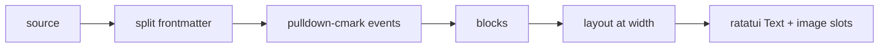

# Rendering

How markdown, raw source, code, tables, and diagrams are rendered, including herdr's graphics constraints.

## Pipeline



- Rendering produces a `RenderedDoc`: a list of blocks, each with its source line range. This mapping is what makes the raw toggle, `$EDITOR` jumps, and link focus line up.
- Layout is width-dependent and cached per `(page, width, theme)`.
- **In-tree renderer** ([ADR-0011](../decisions/0011-renderer-source.md)): pulldown-cmark → `StyledLine` / `StyleKind` + `LinkSpan` geometry in `wiki-reader-render`. Nothing was ported from markdown-reader; ADR-0002's port escape hatch remains unused.

## Links in the render output

The renderer is responsible for making links interactive. For each link it emits:

```rust
struct LinkSpan { id: LinkId, target: Target, segments: Vec<(line: u32, cols: Range<u16>)> }
```

- `segments` covers every wrapped piece of the link text, so a link broken across lines is one focusable, clickable unit.
- Links are ordered by document position; that order drives `Tab`/`Shift-Tab`.
- Target resolution happens at render time against the index ([content model](../product/content-model.md)), so broken/external styling is known before drawing.
- The reader maps visible segments to screen rects and registers them in the frame's `HitMap` ([architecture](overview.md)). Focus/hover styling is applied at draw time, not baked into the cached layout, so moving focus never re-lays out the page.
- Autolinks (`<https://…>`), reference links (`[x][ref]`), and images wrapped in links are included. Links inside code spans are not.

## Blocks and focusable items

`RenderedDoc` also carries two indexes the viewer's keyboard model needs ([UI spec](../product/ui-spec.md)):

- **Block starts:** the rendered line where each content block begins (paragraph, list, code, table, quote, diagram, heading). `Shift+↑/↓` jump between these, and headings are flagged for the proposed heading-jump.
- **Focusable items:** links and block actions (expand table, frontmatter, diagram, copy code) in document order, each with its line. The viewer appends the footer's prev/next buttons to build the `Tab` cycle.

Both indexes are computed once per layout and stay valid across focus changes.

## Element coverage (P0)

Headings (distinct per level), paragraphs with wrapping, bold/italic/strike/inline code, ordered/unordered/task lists (nested), blockquotes and GitHub-style alerts (`> [!NOTE]`, plus custom `goal`/`decision`/`risk`), fenced code with theme `StyleKind` spans (not syntect), tables (fit to width, truncate with `…`, `Enter` to expand), links (styled, focusable), horizontal rules, and frontmatter as a collapsible metadata box.

## Raw view

- Syntax-highlighted markdown via syntect's markdown grammar (off the UI thread, with a cache), with a line-number gutter.
- Same cursor line as rendered mode.
- Always available, even if rendering fails. It is the universal fallback.

## Diagrams (see [ADR-0004](../decisions/0004-diagram-rendering.md))

Tiers, chosen per block:

1. **Image** (deferred): mermaid source → SVG (`mermaid-rs-renderer`) → PNG (`resvg`) → terminal image (`ratatui-image`). Status: not wired yet; confirm Kitty detection under herdr first ([ADR-0004](../decisions/0004-diagram-rendering.md)).
2. **Text** (shipped): `mermaid-text` renders Unicode box-drawing diagrams synchronously with a content-hash cache. Default everywhere, including inside herdr.
3. **Source**: a highlighted code block with a footer giving the reason (`no graphics: sixel not forwarded by herdr`, `parse error: …`).

### herdr constraint

herdr parses pane output with its own VT layer and re-emits frames. Kitty graphics are forwarded to capable outer terminals, but Sixel and iTerm2 inline images are dropped. So:

- `HERDR_ENV=1` and the outer terminal supports Kitty graphics (Kitty, Ghostty, WezTerm with kitty enabled) → image tier via Kitty protocol, with herdr's `terminal.kitty_graphics` enabled.
- `HERDR_ENV=1` otherwise → **text tier by default**. Never emit Sixel.
- `$TMUX` set → text tier (tmux passthrough is fragile).
- Config override: `diagrams = "auto" | "image" | "text" | "source"`.

Validate early ([roadmap](../roadmap/README.md) phase 2): check whether ratatui-image's protocol detection gives a correct answer inside a herdr pane, or whether it needs an explicit protocol pick from env hints.

### Other images

`` uses the same tiers: Kitty image → a `[image: alt]` placeholder with the path. Remote images are never fetched.

## Performance budgets

- Parse + layout of a 50 KB page: < 20 ms.
- Layout caches the full page at the current width; draw clips to the viewport (no per-scroll rematerialize of only visible blocks).
- Mermaid text-tier cache is shared across pages; image-tier raster (when enabled) stays off the UI thread.
