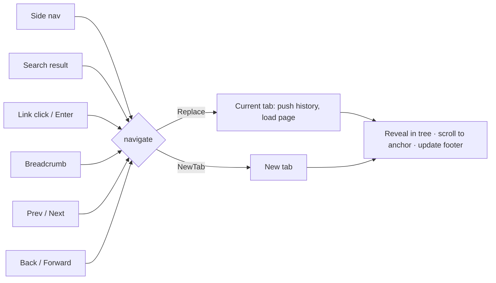

# ADR-0005: Wiki navigation model

**Status:** Accepted · **Date:** 2026-09-28

## Context
In Phase 0, markdown-reader showed an IDE-style model: opening files interacts with tabs, search feeds a tab picker, and links can't be followed. Each entry point behaves a bit differently. For a wiki this is the wrong model. Readers expect a site: click to go, back to return, tabs only when asked.

## Options

**A. IDE model:** tabs primary, each open adds or focuses a tab. Good for editing several files; bad for following links through a wiki.

**B. Browser model:** one view per tab with a history stack; every navigation replaces the view and pushes history; new tabs are explicit (middle-click / Ctrl-Enter).

**C. Single view, no tabs:** simplest, but loses "keep this open while I look something up."

## Decision
**B.** Every entry point (tree, search, links, breadcrumbs, prev/next, history, start page) funnels through `App::navigate(target, disposition)`, with `Replace` as the default. The tab bar is hidden until a second tab exists.

## Consequences
- ➕ Consistent behavior everywhere; enforced by invariant tests ([architecture](../architecture/overview.md)).
- ➕ Matches every reader's existing mental model from browsers and doc sites.
- ➖ Anchor jumps and history need care (scroll restore, forward truncation).
- ➖ `Tab` belongs to link focus in the reader, so region switching needs another key (`Ctrl-w`/`F6`).
