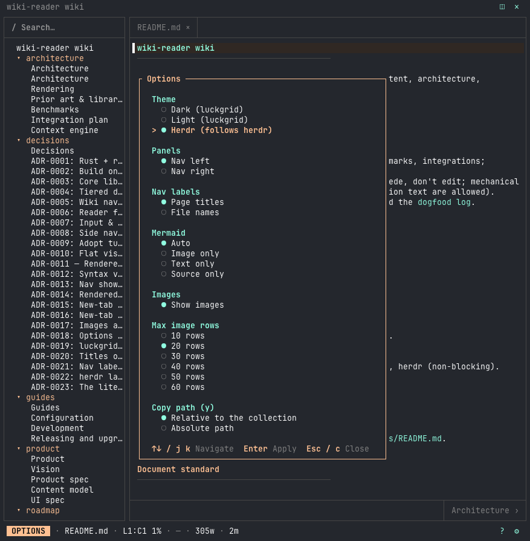

# Configuration

Config is optional. Every key has a default, and a bad value never stops startup: it is ignored, a diagnostic shows in the status bar, and the earlier value (or the default) stays.

## Files and merge order

Files are merged in this order, and a later file wins for a key it sets:

1. **User file:** `$XDG_CONFIG_HOME/wiki-reader/config.toml`, else `~/.config/wiki-reader/config.toml`.
2. **Collection file:** `<collection root>/.wiki-reader.toml`.
3. **`--config PATH`:** an explicit file, if given.

The collection file is untrusted, since it comes with the content you are reading. `opener`, `editor` and `keys` are ignored there (with a diagnostic) and are honoured only in the user file or `--config`. `exclude` patterns from all files are combined.

## Keys

| Key | Values | Default | Notes |
|-----|--------|---------|-------|
| `theme` | `"dark"`, `"light"`, `"herdr"` | `"dark"`, or `"herdr"` inside herdr | `dark` and `light` use the luckgrid.net colours and paint their own background; `herdr` follows the theme in herdr's config. See [UI spec: Theming](../product/ui-spec.md) and [ADR-0019](../decisions/0019-theme-presets.md). |
| `nav.position` | `"left"`, `"right"` | `"left"` | Side nav on the left or right edge. Nav width stays session-only. |
| `nav.labels` | `"title"`, `"filename"` | `"title"` | Side-nav page titles or actual filenames including extensions; folders keep on-disk names. Header/footer labels stay title-based. |
| `diagrams` | `"auto"`, `"image"`, `"text"`, `"source"` | `"auto"` | Mermaid tier; see [ADR-0004](../decisions/0004-diagram-rendering.md). tmux always uses text. |
| `images.enabled` | `true`, `false` | `true` | `false` skips the terminal graphics probe and shows text placeholders. No effect in the [lite build](#lite-build). |
| `images.max_slot_rows` | integer `1`–`60` | `30` | Tallest picture or diagram slot, in rows. The options window offers 10, 20, 30, 40, 50, 60; other values in that range still work from the file. |
| `herdr.publish` | `true`, `false` | `true` | Inside a herdr pane, show the page being read in herdr's sidebar (title and a `page` token, renewed while open and cleared on exit). Display-only; never reports agent state. Plugin popups have no pane of their own and never publish. See [ADR-0022](../decisions/0022-herdr-launcher-and-page-publishing.md). |
| `copy.path` | `"relative"`, `"absolute"` | `"relative"` | What `y` ("Copy file path" in Help) copies: with the nav focused, the selected row's file or folder path; with the viewer focused, the open page's path. Relative to the collection root, or absolute. Also a row in the options window. |
| `exclude` | glob, or list of globs | none | Paths left out of the collection. |
| `opener` | command string | system opener | Opens external URLs: program, then its args, then the URL. User file or `--config` only. |
| `editor` | command string | `$VISUAL`, else `$EDITOR` | User file or `--config` only. Config wins over the environment when set. |
| `keys` | table of action name → chord | none | User file or `--config` only, for example `quit = "Q"`. |

```toml
theme = "herdr"
copy.path = "absolute"

[nav]
position = "right"
labels = "filename"

[images]
max_slot_rows = 24

[herdr]
publish = false
```

Legacy `nav.labels = "title+filename"` is read as `"title"` with one warning per config load, even if several config layers use it. Loading does not rewrite files; choose a supported value in Options or edit the config to stop the warning. See [ADR-0020](../decisions/0020-nav-label-modes.md).

## Environment

| Variable | Effect |
|----------|--------|
| `WIKI_READER_NO_WATCHDOG` | Set to `1` to turn off the session-leader check. By default wiki-reader exits within a few seconds when the shell that owns its terminal session is gone, because a reader left in that state spins at about 100 % CPU. A launcher that merely exits while that shell and the terminal live does not end the session, so most setups never need this; with the check off, an orphaned reader can spin until killed. A terminal that has hung up always ends the session. Empty, `0`, `false`, `no` and `off` leave the check on. |
| `WIKI_READER_IMAGE_QUERY_TIMEOUT_MS` | Timeout for the terminal graphics probe at startup. Mainly for the `image-protocol` example; see [P3-S1](../roadmap/spikes/p3-s1-image-protocol.md). |

## Lite build

`cargo install --locked --no-default-features --git https://github.com/luckgrid/wiki-reader wiki-reader` builds without the image stack ([ADR-0023](../decisions/0023-lite-build-is-a-cargo-feature.md)). `images.enabled` and `images.max_slot_rows` are still read but have no effect: every image is a text placeholder, no graphics probe runs, and the options window hides the Images and Max image rows groups. `diagrams = "image"` renders the text tier with the header `lite build: no image tier`; `auto` and `text` look the same as on a terminal without graphics. Everything else is unchanged.

## Options window

`,` or `c` (or the layout footer ⚙) opens the options window, and the same keys, or `Esc`, close it. Each setting is a group of radio rows: `↑` / `↓` or `j` / `k` move; `Enter`, `Space` or `→` applies. It edits `theme`, `nav.position`, `nav.labels`, `diagrams`, `images.enabled`, `images.max_slot_rows` and `copy.path`. Each change applies at once and is saved to one key of the file, per [ADR-0018](../decisions/0018-config-write-path.md):



- **Write target:** `--config PATH` if you started with it, else the user file. The collection `.wiki-reader.toml` is never written. The file and its folder are created when missing, and comments and unknown keys are kept.
- **A collection file can win on restart.** If `.wiki-reader.toml` sets the same key, it overrides the value saved to the user file the next time you start. The status bar says so when you change such a key. Edit or remove the key in the collection file, or start with `--config` to make the saved value final.
- **Images:** turning images on after they were off at startup needs a restart, because terminal graphics are probed once.
