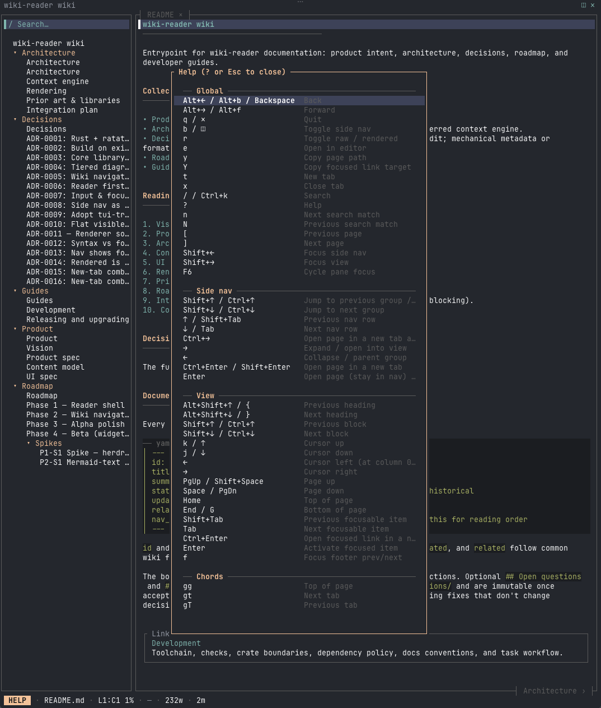
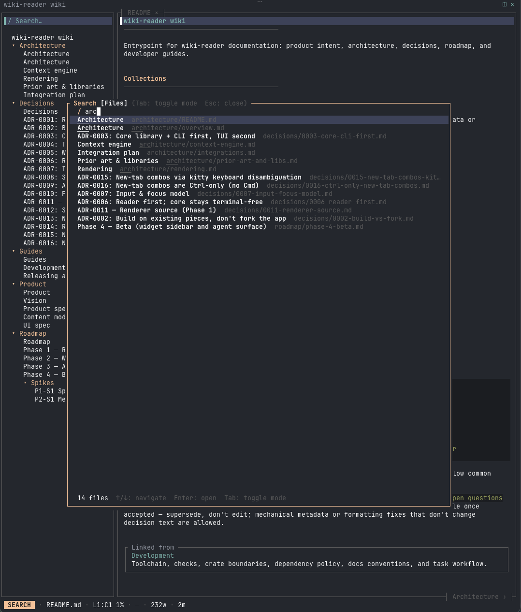

# UI spec

Layout, side nav, header/footers, focus and cursor model, keyboard and mouse behavior for the wiki-reader reader.

## Layout

<!-- ui-diagram:start -->
```text
 Worked Example Wiki                                                        ◫ ✕
┌────────────────────────┐┌─────────────┬─────────────┬────────────────────────┐
│ / Search…              ││ README.md × │ tokens.md × │                        │
├────────────────────────┤├─────────────┴─────────────┴────────────────────────┤
│▌ Worked Example Wiki   ││▌── frontmatter ▸ ──────────────────────────────────│
│  ▸ architecture        ││                                                    │
│  ▸ decisions           ││ Worked Example Wiki                                │
│                        ││ ────────────────────────────────────────           │
│                        ││                                                    │
│                        ││ A tiny markdown collection used as the default     │
│                        ││ smoke-test root.                                   │
│                        ││                                                    │
│                        ││ Start at Architecture Overview, follow Token       │
│                        ││ Projection, then return via back when history      │
│                        ││ exists. Enter a picture for Tab carousel / a fit.  │
│                        │├────────────┬─────────────┬─────────────────────────┤
│                        ││ ‹ Overview │             │ Architecture Overview › │
└────────────────────────┘└────────────┴─────────────┴─────────────────────────┘
  VIEW  · README.md · L1:C1 9% · 2026-09-28 · draft · 29w · 1m              ? ⚙
```
<!-- ui-diagram:end -->

The same layout in the running app, on this wiki:


Help (`?`) and search (`/`) open as popups over it, with both panes grayed behind. Pictures are drawn under the popups; a picture whose first cell a popup covers is held back until that cell is visible (its one-time Kitty upload rides in the cell), so it appears when the popup closes rather than staying blank:





Nav rows show page titles by default and folders show the folder name (see [Side nav](#side-nav)). The layout footer's `?` opens Help and `⚙` opens Options (`,` / `c`); the header's `◫` toggles the side nav (`b`) and `✕` quits (`q`).

Regions:

- **Header:** one padded row with the breadcrumb on the left and the icon buttons on the right, directly above the panes. The last crumb is the current page and is drawn gray (read-only); the others are links.
- **Side nav:** a bordered pane holding the search bar and the page tree. Neither pane has a title tag; the status pill (`NAV` / `VIEW`) says which one has focus. Its width defaults to 26 (30 at ≥ 120 columns) and can be dragged.
- **View:** a bordered pane with a **three-row tab bar** at the top and a **three-row prev/next bar** at the bottom, both fully bordered boxes with `│` dividers between cells and no background fills. Each bar is the pane border, a label row and a seam rule. Article content starts below the top bar and ends above the bottom bar; the cursor line is marked `▌`.
- **Status bar:** one padded row directly under the panes.

**Tabs** show actual filenames including extensions (`tokens.md`, `×` closes), even for a single page whenever a complete label and close glyph fit. Each tab is its own cell, separated by `│`; the rest of the bar is an empty cell. The active tab is bold in the focus colour (peach in the herdr presets) with View focus, bold secondary text with Nav focus, and muted like the other tabs behind popups. Inactive tabs use muted text. Every bar glyph is thin and takes the border style of its pane (focus colour when focused, dim otherwise), so the bar always matches the pane frame. A right-hand widget slot is reserved for Phase 4.

### Batch A layout (P3-18 / P3-17)

P3-18 places ⚙ at the full-width layout footer's far right, below both panes, with `?` immediately to its left; the header retains ◫ and ✕. P3-17 gives the View **three-row top and bottom bars** (pane border, label row, seam), with complete borders and dividers. This supersedes the earlier compact two-row bars with a heavy `━` underline, which the operator rejected after a screenshot review: the heavy rule was thicker than the pane border and took the label's colour instead of the pane's. No tab or prev/next background fills remain. Labels that are selected use the focus colour, bold; everything else is muted.

The layout footer reserves space for `?` / ⚙ before laying out status fields and messages. The View footer independently divides its width between prev/next. Labels truncate with `…`; unavailable links remain absent. Controls must not overlap, including at 40/60 columns and with Nav on either side. Collision policy: reserve the active tab first, ellipsizing its filename to the available label width (maximum 18 columns), then add other tabs in order only if each whole cell and its divider fits. Hide all tabs when fewer than seven columns are available. Prev and next cells are sized to their labels, each capped so that the two cells and their dividers fit in the interior; ellipsize labels and hide a cell if its cap cannot fit padding, an arrow and one label column. Hits occupy only the label row of each bar, never the border or seam rows. Short-terminal policy: retain the one-row layout header/footer whenever height permits; give the View's top bar its three rows first, then its bottom bar three more. Draw a bar only when all of its rows fit; an edge without a bar keeps just the pane's border row, with no controls or hits. Article rows are the remainder after the edges (six chrome rows when both bars fit). P3-01 sticky headings are explicitly deferred by operator decision; no additional sticky row is reserved.

The ASCII diagram documents the bar layout. Screenshot PNGs are refreshed in P3-23 once the operator retakes them in Ghostty (Screen Recording permission); the ASCII and carousel keys ship with the docs refresh even when the PNGs wait.

## Header (full width, 1 padded row)

- **Left:** the root entry page's title, then the breadcrumb trail through side-nav groups to the current page. Example: `Project Wiki › architecture › design-system › Token Projection`. Segments follow the **side nav hierarchy** (groups), not raw directories, so folded folders ([content model](content-model.md)) don't produce extra crumbs. Each segment is clickable and opens that group's landing page. The trail drops middle segments with `…` when narrow, preferring the root and current page. Header icons reserve their right-hand columns first; any labels that still exceed the remaining space are ellipsized, and breadcrumb hit areas stop before the controls.
- **Right:** icon buttons. `◫` toggles the side nav. `✕` quits (saves session; same as `q`). There is no syntax/formatted toggle: Rendered is always the formatted view and `r` shows the markdown syntax ([ADR-0014](../decisions/0014-remove-formatted-view-toggle.md)). Help (`?`) and Options (⚙) live in the layout footer below both panes.
- Future: optional back/forward buttons (`‹ ›`). Back/forward are keyboard-only in v1.

## Side nav

A file tree **presented as a documentation site's side nav**. By default it docks on the **left**; `nav.position = "right"` puts it on the right (P3-11). Narrow terminals (&lt;80) still overlay from the left. Construction rules are in [content model](content-model.md). In short:

- The root entry page (root `README.md`/`index.md`) is the first item.
- Folders always show the **on-disk folder name**, preserving case, hyphens and numeric prefixes. Pages are labelled by `nav.labels`: **`title`** (default: `nav_title` → `title` → first H1 → humanized filename) or **`filename`** (actual filename including extension, e.g. `README.md`). In title mode, landing pages show their title, falling back to the folder name (root: collection name). Legacy `title+filename` maps to `title` with one warning per config load; see [ADR-0020](../decisions/0020-nav-label-modes.md). This setting affects **only the side-nav tree**: header breadcrumbs and View footer links always retain title-mode navigation labels ([ADR-0021](../decisions/0021-side-nav-only-label-mode.md)).
- Every folder with a README is a **collapsible group** (the folder name) whose first item is the README, labelled with its title. A folder holding only a README is still a group with that one item.
- Folder rows use the herdr tab peach (in the herdr presets, the same colour as the selected tab and footer link labels, the focused pane border, the status pill and the popup border) and nested rows indent three more columns per level, so a child starts one column right of its parent's label. The list always starts right under the search bar when it fits (it scrolls only to keep the current row visible). The selected row has a full-width background highlight and a `▌` marker; it follows the current page however you got there (a link, the footer, search, history). Ancestor groups auto-expand after every navigation. A row that does not fit the pane width ends in `…`.
- The pane is **resizable**: drag the divider on the inner edge between the nav and the viewer (clamped to 16–50 columns; the width is saved with the session and ignored below 80 columns). Nav width stays session-only; position is config.

**Search entry (top of the side nav).** The first row is `/ Search…` (`/` is the key that opens search, and it renders at text height in every font), drawn as a bordered bar that lines up with the View's tab bar: a label row followed by a seam rule, with no fill. The text is muted; when it is the focused nav stop it turns bold in the focus colour, like a selected tab. Selecting it, clicking it, or pressing the search hotkey anywhere opens the **search overlay panel** (below). It's a nav stop for Shift+↑/↓ (see keyboard).

Future: this search bar becomes a proper **side nav header**, and a **side nav footer** can hold widget actions or tabbed features (e.g. Pages / Outline).

## Search overlay panel

- Opens with `/` or `Ctrl-k` from anywhere, a click on the search row, or `Enter` on it.
- Floats over the side nav and viewer, which both drop their active colours (gray borders, no highlighted tab) while it is open. The input row sits directly under the title border, then the results, and a footer row tight against the bottom border; two columns of padding left and right. A result row cut off at the right edge ends in `…`.
- The title carries the mode and the key hints: `Search [Files] (Tab: toggle mode  Esc: close)`. The input row is `/ █ type to search…` with the placeholder beside the cursor. The footer shows the counts (`N files`, or `N files, M matches`) and `↑/↓: navigate  Enter: open  Tab: toggle mode`.
- A toggle (`Tab` inside the overlay) switches between **Files** (fuzzy title/path) and **Content** (full-text). Files is the default.
- Results use a large centered pane (~80% × ~80%, up to ~100 × 50). The list scrolls; `Home`/`End`/`PgUp`/`PgDn` and the mouse wheel jump or step selection. The selected row's background spans the full width. Content rows start with the source line number (`[12]`, peach), then the bold title, the dim path and the snippet, with query matches underlined.
- `↑`/`↓` or mouse selects; `Enter` or click opens the result in the current view (replace + history), lands on the match: the page stays where it normally loads (it scrolls, centring the match, only when the match is off-screen), the searched phrase is highlighted in the active-tab peach and the cursor sits on its first letter (the default text colour as a block, the glyph inverted); `n`/`N` then cycle matches in the page.
- `Esc` or a click outside closes it and restores the previous focus and cursor.
- The last query and results are kept for the session.

## Help overlay panel

- Opens with `?` from Normal mode. Generated from the binding table in `keymap.rs` (same source as the live map).
- Sections: Global, Side nav, View, Chords, Search overlay. Each section is a full-width divider row. Keys that do the same thing share one row, joined with ` / ` (`↑ / Shift+Tab`); alternates sit next to each other in the table so they merge. A chrome icon that also triggers an action is joined to its key with ` / ` like any alternate key (`b / ◫`, `q / ✕`, `? / ?` for the Help key and footer button). The panel is tall and thin (up to 58 columns wide, nearly full height), peach-bordered like the search popup, with the same side padding, a blank row at the top and bottom, a blank row above each group divider and none below, a full-width selected row, and both panes behind it grayed. Key labels show config overrides when set.
- `↑`/`↓` / `PgUp`/`PgDn` / `g`/`G` and the mouse wheel scroll; `Enter` or a click on a row closes help and runs that action (display-only rows are not clickable).
- `Esc` or `?` closes without an action. Click outside dismisses.

## Options window

Opened with `,` or `c` (or the layout footer ⚙); the same keys close it, as does `Esc`. It floats over the panes like Help and Search.

- **Grouped choices.** Each setting is a group with a title, and each value is one row with a radio mark: `●` is the active value, `○` the others. A group is one of Theme, Panels (nav position), Nav labels, Mermaid, Images, Max image rows, Copy path (`y`). Show images is an on/off row in the Images group.
- **Navigation.** `↑` / `↓` or `j` / `k` move the `>` cursor between rows (it skips titles and wraps); `Enter`, `Space` or `→` applies the row, and a click selects and applies it. The window opens on the current theme. The footer lists the keys. It scrolls on short terminals and keeps a group's title with its first row.
- **Live and saved.** A change applies at once and is written to the user config file (see [Configuration](../guides/configuration.md) and [ADR-0018](../decisions/0018-config-write-path.md)).

## View (center)

Rendered by default (the formatted view: no `#`, fences or backticks); `r` toggles raw, which shows the markdown syntax. Both views share the **cursor line** (see Cursor model), so toggling keeps you on the same source line. The raw view **soft-wraps** long lines to the pane width: the gutter number shows on a line's first row only, and copying across wrapped rows gives the source line back exactly. The frontmatter box's rules span the full pane width. The text column is capped at ~100 cols; tables and code may use the full width.

**Focusable items ("actions")** are what `Tab` cycles through, in document order:

1. Links (internal, anchor, external, broken)
2. Block actions: expand/collapse frontmatter (`▸`/`▾`, key-reachable and clickable from the first frame), copy a code block (OSC 52)
3. The View footer's ‹ Prev / Next › buttons (last in the cycle)

After the last item, `Tab` wraps to the first. The focused item renders inverted, and the status bar shows its target or action (`→ decisions/0003.md#context`, `↗ https://…`, `? not found: foo.md`, `copy code`).

**Links:** underlined; broken links in the error color with `?`; external links with `↗`. `Enter` or left-click follows. Middle-click, Shift/Ctrl+click, or `t` opens in a new tab (`Ctrl+Enter` on a focused link does too where the kitty protocol reports it). External links ask `open https://… ? [y/N]` in the status bar, then use the system opener. Hovering (if the terminal reports motion) highlights the link and shows its target in the status bar.

**End of article:** "Linked from" pane (box-drawn with side borders: tag header, each entry's title and optional one-line summary as one focusable hit; Tab focus paints selection background across the entry and replaces the left `│` with a teal ▌). Summary comes from frontmatter or the first body paragraph as plain text (no markdown markup), truncated with `…` when it would wrap.

Deferred (P3-01): a **sticky section header** at the top of the viewer showing the heading of the section in view. No extra row is reserved in this layout.

## View footer (prev/next)

Connected `‹ Prev title` and `Next title ›` controls sit in their own cells on the left/right of the **View's three-row bottom bar**, following side nav order ([content model](content-model.md)) but always using title-mode labels, regardless of `nav.labels`. They remain pinned while the article scrolls; hits occupy the label row only; the bar's seam is above it and the pane's bottom border below. Labels are dim by default; a control reached with `Tab` or `f` uses bold focus-colour text instead of a background fill. Each label is truncated with `…` to its cell's cap so long titles cannot collide. Help / Options are not on this bar; they belong to the layout footer below it. Both are clickable and bound to `[` / `]`. A side with no prev/next draws no cell.

## Modal viewers

Table and image/diagram viewers share one modal shell (`Esc` dismisses, wheel scrolls, click outside dismisses, drawn after a `Clear` so they sit above Kitty pictures). Entry points are block actions in the View Tab cycle plus `Enter` on the focused table or image slot. The panel is **content-sized**: it wraps its content (at least 40 body columns), is centred, and never exceeds the full-size panel (the area inset by two columns and one row; tiny terminals get all of it). A wide table or picture therefore keeps today's width. The modal's keys are listed in Help under *Table and image viewers*, and the hint bar along the panel's bottom edge shows the ones that apply.

**Table viewer.** Opens from the expand-table block action or `Enter` on any row of a table. Keys: arrows / `hjkl` move the cell cursor; `PgUp` / `PgDn` page; `g` / `G` top / bottom; `/` filter rows (`Enter` keep, `Esc` clear); `s` cycles sort asc / desc / off on the current column; `y` copies the cell; `Y` copies the row (tab-separated). The header row and first column stay fixed while the body scrolls. Cells keep their inline styling (bold, link colour, code) and the header stays bold; filter, sort and copy use the plain text. The panel is as wide as all columns and as tall as all rows, up to the cap.

**Image and diagram viewer.** Opens from the expand-diagram block action (`Enter` on the Mermaid fence line) or `Enter` on any row of a picture slot. Keys: arrows / `hjkl` pan by an eighth of the window; `PgUp` / `PgDn` and `g` / `G` as in the table viewer; `+` / `-` zoom (100–800 % of the base size); `0` fits the window and resets zoom; `a` toggles **fit** and **actual size**; `Tab` / `Shift+Tab` step to the next / previous image or diagram of the page, wrapping; `v` cycles a diagram's views. The wheel pans vertically. SVG and Mermaid re-rasterise at the zoomed size; raster files scale from the decoded bitmap.

- **Sizing.** *Fit* scales the picture to the largest panel, enlarging small pictures up to 2× natural size, so an opened picture is always larger than its inline slot (which never exceeds natural size). *Actual size* is natural pixels (one picture pixel per terminal pixel; SVG and Mermaid at their natural SVG size) and pans when it exceeds the panel. Zoom multiplies either base. The 16-megapixel cap applies to every size. The panel wraps the picture, so a small picture gets a small panel and a wide one keeps the full width.
- **Carousel.** The inventory is every block image and Mermaid fence of the page in document order, whatever tier the page painted it with. A picture that could not be loaded (remote, missing, too large) is an entry that shows why. The one opened shows first; each item starts at fit, zoom 100 %. Arrows stay pan.
- **Diagram views.** `v` cycles *image* → *text* (terminal text art at the panel width) → *source*, for the open diagram only; nothing is saved. *Image* is skipped when the terminal has no graphics protocol (the viewer then opens on *source*, as the inline tier did). The lite build has no image viewer at all (`image viewer is not in this lite build`).
- **Hint bar.** `←↑↓→ pan  +/- zoom  0 fit  a actual  g/G top/end  Tab/⇧Tab item  v image/text/source  Esc close`; `Tab/⇧Tab` shows only with more than one item, `v` only with more than one view, and the text views show `↑↓ scroll … (source view)`.

## Layout footer / status bar (full width, 1 row)

Like markdown-reader's: focused region as a highlighted pill (`NAV`/`VIEW`, or `SEARCH`/`HELP` while a popup is open; peach, like the tabs and footer links), relative path, cursor line:column (`L12:C5`) and scroll %, updated date and the page's frontmatter `status` (colored by value), word count, reading time, and a **message area** for link targets, notices ("not found"), confirmations, and search match `n/m`. Help `?` and Options ⚙ are right-aligned on this row, one column inset from the terminal edge, with `?` two columns left of ⚙. Reserve their four columns before laying out status fields or messages so text cannot overwrite them. Lower-priority items drop first when narrow. On tiny widths draw and register only visible icon glyphs; a hidden footer has no hits.

Frontmatter `status` colours (`tui/theme.rs`): `draft` → `status_warn` (orange); `proposed` → `status_plan` (blue); `accepted` / `active` / `done` → `status_ok` (green); `deferred` / `superseded` / `historical` → muted. Unknown values keep the plain text colour so user collections can keep a private vocabulary.

## Focus & cursor model

Two focusable panes: **Side nav** and **View**. The search overlay is modal while open.

- `Shift+←` focuses the side nav; `Shift+→` focuses the View. Mouse click also focuses a pane.
- In the View, `←`/`→` move the cursor one **column** within the row (shown in the status bar as `L12:C5`); at the edge toward the nav (`←` at column 0 when the nav is left, `→` past the last column when it is right) focus moves to the side nav. Nav `→` still opens the page and focuses the View (right on the page that is already open just moves focus, keeping the View's cursor and scroll).
- The column is *sticky*: moving up/down through short rows and back returns to the column you wanted. A hidden nav is revealed when `←` hands focus to it.
- **Each pane remembers its cursor.** Switching returns to the last known position in that pane.
- **Defaults when a pane has no remembered position:**
  - Viewer: top of the current page.
  - Side nav: the item for the current page (e.g. when the root README is open, the top item).
- **Navigation updates cursors:**
  - Opening a page sets the viewer cursor to the anchor target, else to the remembered cursor for that history entry (back/forward), else the top.
  - If the current page changed while the side nav wasn't focused (via a link, search, or prev/next), refocusing the side nav puts its cursor on the new current page rather than its stale position. Otherwise it keeps its remembered position.
- The focused pane gets a focus-colour border (peach in the herdr presets) and its bars and search seam follow it; the other pane gets a dim border.

## Keyboard

The tables below are generated from the binding table that also drives the `?` help overlay, so they cannot drift from it. `Esc` closes overlays; it does not quit.

<!-- keymap:start -->
Generated from `BINDINGS` in `crates/wiki-reader/src/tui/keymap.rs`, the same table the `?` help overlay shows. Edit the table there, then run `UPDATE_DOCS=1 cargo test -p wiki-reader keymap_docs`.

### Global

| Key | Action |
|-----|--------|
| `Alt+← / Alt+b / Backspace` | Back |
| `Alt+→ / Alt+f` | Forward |
| `q` ✕ | Quit |
| `b` ◫ | Toggle side nav |
| `r` | Toggle raw / rendered |
| `e` | Open in editor |
| `y` | Copy file path |
| `Y` | Copy focused link target |
| `t` | New tab |
| `x` | Close tab |
| `/ / Ctrl+k` | Search |
| `?` ? | Help |
| `, / c` ⚙ | Options (toggle) |
| `n` | Next search match |
| `N` | Previous search match |
| `[` | Previous page |
| `]` | Next page |
| `Shift+←` | Focus side nav |
| `Shift+→` | Focus view |
| `F6` | Cycle pane focus |

### Side nav

| Key | Action |
|-----|--------|
| `Shift+↑ / Ctrl+↑` | Jump to previous group / search |
| `Shift+↓ / Ctrl+↓` | Jump to next group |
| `↑ / Shift+Tab` | Previous nav row |
| `↓ / Tab` | Next nav row |
| `Ctrl+→` | Open page in a new tab and focus view |
| `→` | Expand / open into view |
| `←` | Collapse / parent group |
| `Ctrl+Enter / Shift+Enter` | Open page in a new tab |
| `Enter` | Open page (stay in nav) / toggle group |

### View

| Key | Action |
|-----|--------|
| `Alt+Shift+↑ / {` | Previous heading |
| `Alt+Shift+↓ / }` | Next heading |
| `Shift+↑ / Ctrl+↑` | Previous block |
| `Shift+↓ / Ctrl+↓` | Next block |
| `k / ↑` | Cursor up |
| `j / ↓` | Cursor down |
| `←` | Cursor left (at edge toward nav: focus side nav) |
| `→` | Cursor right (at edge toward nav: focus side nav) |
| `PgUp / Shift+Space` | Page up |
| `Space / PgDn` | Page down |
| `Home` | Top of page |
| `End / G` | Bottom of page |
| `Shift+Tab` | Previous focusable item |
| `Tab` | Next focusable item |
| `Ctrl+Enter` | Open focused link in a new tab |
| `Enter` | Activate focused item |
| `f` | Focus footer prev/next |

### Chords

| Key | Action |
|-----|--------|
| `gg` | Top of page |
| `gt` | Next tab |
| `gT` | Previous tab |

### Search overlay

| Key | Action |
|-----|--------|
| `Esc` | Close search |
| `Enter` | Open selected result |
| `Tab` | Toggle Files / Content |
| `↑ / ↓` | Move selection |
| `Home / End` | Jump to first / last result |
| `PgUp / PgDn` | Page results |

### Table and image viewers

| Key | Action |
|-----|--------|
| `↑↓←→ / hjkl` | Move the table cell cursor, or pan a picture |
| `/` | Table: filter rows |
| `s` | Table: sort by the current column |
| `y / Y` | Table: copy cell / row |
| `+ / -` | Picture: zoom in / out |
| `0` | Picture: fit the window, reset zoom |
| `a` | Picture: toggle fit / actual size |
| `Tab / Shift+Tab` | Picture: next / previous image or diagram |
| `v` | Diagram: cycle image / text / source |
| `Esc / q` | Close the viewer |
<!-- keymap:end -->

### Notes

- **Tab and cursor:** `Tab` focuses the first item *after* the cursor line, and the cursor line moves to that item. Moving the cursor with arrows clears item focus (and sticky footer focus). Activating a footer link keeps focus on that side after the page changes, so you can step through pages quickly. This keeps one visible "where am I" at all times.
- **`Enter` in the viewer:** activates the focused item. With no item focused and exactly one link on the cursor line, it follows that link.
- **Side nav `→` / `←`:** `→` expands a group; on an expanded group it steps to the first child; on a page row it opens the page and focuses the viewer. `←` collapses, or goes to the parent group from a child.
- **Side nav `Enter` / click:** a page opens in place and the nav keeps focus; a group toggles; the search row opens the search overlay.
- **New tabs:** `t`, middle-click, Shift+click or Ctrl+click opens the focused link or nav row in a new tab; `Shift+Enter` and `Ctrl+Enter` do the same where the terminal reports them, and in the nav `Ctrl+→` also moves focus into the new tab's view ([ADR-0015](../decisions/0015-new-tab-combos-kitty-keyboard.md), [ADR-0016](../decisions/0016-ctrl-only-new-tab-combos.md)).
- **Back / forward:** `Backspace` is primary. `Alt+b` / `Alt+f` are what macOS Ghostty sends for Option+←/→.
- **Heading jump:** `{` / `}` is the fallback when `Alt+Shift+↑/↓` does not reach the TUI.

### Terminal key caveats (verified, Ghostty + herdr, macOS)

- **K1:** Ghostty sends Option+←/→ as readline `Alt+b` / `Alt+f`, not as arrows with ALT. Bind `Alt+b`→Back and `Alt+f`→Forward (P1-R36); keep `Backspace` and `Alt+←/→` when those arrive as arrows.
- **K2:** Plain-letter bindings must ignore CONTROL/ALT (P1-R36). Before that fix, Alt+q quit, Alt+e opened the editor, Ctrl+b toggled the nav.
- **K3:** Right-click is reserved by herdr's context menu and never reaches the app — unused by wiki-reader.
- **K4:** Alt+↑/↓ and Alt+Shift+↑/↓ arrive correctly; heading jump works.
- `Shift+Tab` arrives as `BackTab`; fine everywhere.
- `Ctrl+Enter` / `Ctrl+→` / `Shift+Enter` need the kitty keyboard protocol (`DISAMBIGUATE_ESCAPE_CODES`, [ADR-0015](../decisions/0015-new-tab-combos-kitty-keyboard.md)). Without it, `t`, middle-click and Shift+click still work (unless the terminal keeps Shift+click for its own text selection). Cmd is not used: it never arrives on mouse events, and macOS terminals keep Cmd+Enter (Ghostty makes it full screen). On some macOS hosts Ctrl+click is stolen as right-click. `Ctrl+→` is macOS's default "Move right a space" shortcut, so on macOS it never reaches the app unless that shortcut is disabled (System Settings → Keyboard → Keyboard Shortcuts → Mission Control); use `Ctrl+Enter` there.

## Mouse

Click to focus a pane; click items, links, breadcrumbs, prev/next, header icons, the frontmatter toggle and search results; middle-click, Shift+click or Ctrl+click for a new tab; wheel scrolls the pane under the pointer, or the Help/Search popup when one is open.

**Selecting text.** Press and drag in the View to select; both end cells are included and the selection is copied to the clipboard (OSC 52) on release. A plain click only places the cursor, and a link is followed on release if the pointer did not move, so a drag can start on link text. Dragging above or below the pane scrolls it, and keeps scrolling while the pointer is held still there. Any cursor movement clears the selection. What is copied is the text, not the layout: soft-wrapped rows of one paragraph rejoin into one line, code and quote gutters are dropped, table cells are tab-separated with empty cells kept and a wrapped cell rejoined into one (borders dropped), a copy over 75 KB is refused with a status message (OSC 52 payload limit), and in the raw view the source text is copied exactly. Hover works only where motion events arrive. Right-click is owned by herdr (see K3). Click, middle-click, and wheel verified inside herdr panes.

## Responsive rules

| Width | Layout |
|-------|--------|
| ≥ 120 | Side nav 30 (draggable, 16–50) · Viewer flex |
| 80–119 | Side nav 26 (draggable, 16–50) · Viewer flex |
| < 80 | Side nav hidden; `◫`/`b` shows an opaque overlay using the inherited theme background. It closes after navigation or an outside click; that click only dismisses, never activates the underlying target |

## Future UI slots (designed for, not built)

| Slot | Purpose |
|------|---------|
| Viewer header | Sticky heading of the section in view |
| Side nav header | Search field (replacing the search row), mode tabs |
| Side nav footer | Widget actions, tabbed features (Pages / Outline / …) |
| Right widget sidebar | Phase 4 widgets, incl. context engine ([context engine](../architecture/context-engine.md)) |
| Header ‹ › buttons | Optional back/forward |

## Theming

Semantic tokens only (`tui/theme.rs`): `surface`, `surface_muted`, `border`, `border_focus`, `text`, `text_muted`, `text_secondary`, `accent`, `cursor_line`, `peach` / `on_peach` (status pill, focused block actions, popup border; a fill, so never used as text), `border_focus` (also the selected tab and footer link label colour, because it is readable as text on every preset), `link`, `link_broken`, `link_external`, `link_unsupported`, `code_bg` / `code_fg`, `quote_bar` / `quote_text`, `heading[1..6]`, `alert[…]`, `status_ok` / `status_warn` / `status_plan` (frontmatter status; see the status-bar section above), plus two non-colour entries per preset: the syntect theme for the raw view and the Mermaid diagram palette.

The `theme` config key picks a built-in preset:

| `theme =` | For | Notes |
|-----------|-----|-------|
| `"dark"` (default) | Dark terminals | The [luckgrid.net](https://luckgrid.net) dark palette, painted over the whole screen: black background, white text, lime accent, blue links, orange H2–H4. |
| `"light"` | Light terminals | The luckgrid.net light palette, painted over the whole screen: white background, black text, cyan-blue accent. Every text colour is dark enough to read on white (a test enforces ≥ 4.5:1 per token). |
| `"herdr"` | Inside herdr | Follows the theme named in herdr's own config (`[theme] name`): vesper, catppuccin, catppuccin-latte, tokyo-night, tokyo-night-day, gruvbox, gruvbox-light, one-dark, kanagawa, or terminal (ANSI colours). An unknown name uses vesper and says so. Read once at startup; see [ADR-0019](../decisions/0019-theme-presets.md). |

Inside herdr (`HERDR_ENV=1`) the default is `herdr` when no config file sets `theme`; a theme chosen in the options window is written, so it wins from then on.

An unknown value is ignored with a config diagnostic: the value from an earlier config file (user, then collection, then `--config`) stays, or `dark` if there is none. There is no `auto`: asking the terminal for its background would compete with the image probe for stdin (see [ADR-0004](../decisions/0004-diagram-rendering.md)). Mermaid diagrams are drawn in the preset's colours on an opaque card, so a diagram matches the page around it. Node, cluster, note, pie and git-graph colours follow the preset; a few diagram types hard-code light fills in the renderer (quadrant charts, xy-chart grids, ER key badges) and keep them, so they show as light patches on a dark card. Theme files (TOML) are a later seam, see [Integrations](../architecture/integrations.md).
